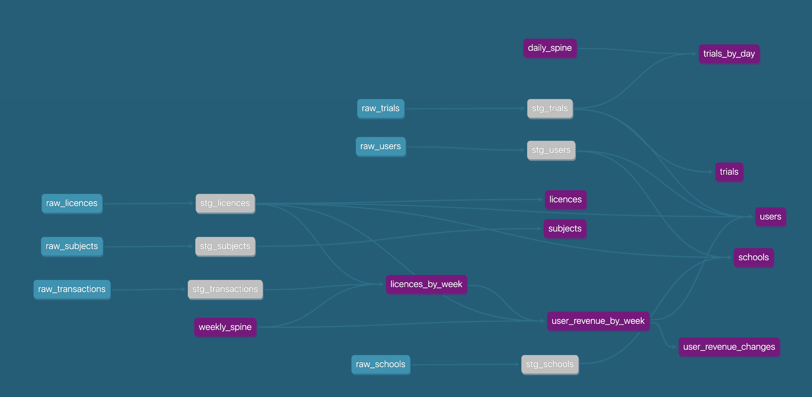

# Testing dbt project: uplearn

This is a simple project for the technical test @uplearn.



For information about the data model refer to [data_model.md](docs/data_model.md)


## Setup

You will need docker installed on your machine. Simply:
```sh
docker compose up
```
This will create some services: 
  * A docker dbt image that'll create a tiny data warehouse on start
  * Lightdash, which you can access on http://localhost:8080
  * A database for both dbt and lightdash services
  * A pgadmin service, which is accessible on http://localhost:16543/

### Set up lightdash:
1. Open http://localhost:8080 and create a user
2. On `select your warehouse`, select postgres
3. After that, select `manually`.
4. On warehouse connection:
```
host: postgres
user: admin
password: admin
dbname: postgres
ssl mode: disable
```
5. On dbt connection
```
type: dbt local server
dbt version: 1.7
target name: dev
schema: public
```
