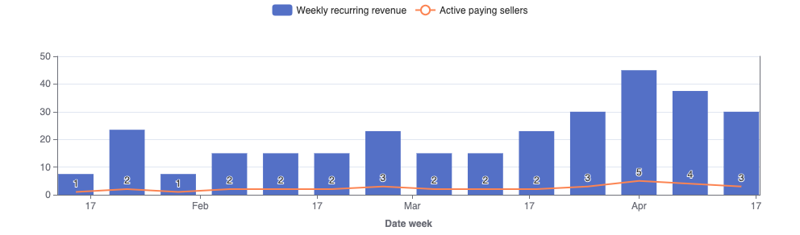

# Uplearn: Data modelling exercise
In this document I'll try to explain the reasoning behind the data model I present in this exercise. 

## The structure
Nothing really fancy, I try to tidy the dwh as dbt recomends. This is:
* Having staging models to clean the data sources (normalize naming, simple calculations...)
* Having some intermediate models
* Having 'dimension' tables. Quoted, because some may argue that those are fact tables with the grain at the entity itself. I'm talking about users, schools, etc. tables. They are dimension tables in the sense that they are dimensions, but they contain some aggregated data from the other tables that can be considered transactional. This is something debatible. For instance, the table `schools` has a count of licences. This can appear here, but it does not need to as can easily be calculated within the visualisation tool.
* Not in this project, but ideally you'd have exposures if you were to export data to any destinations. For the purpose of this test I'm binding lightdash directly to the modelled 

## The tables
I'm not going to be explaining the staging tables because they contain the same information as the raw ones, which are filled with the information provided in the test explanation document. 
* Spines: `daily_spine` and `weekly_spine`. They contain one row per day and per week respectively. Those are helper tables to create other tables. 
* `trials_by_day`: This is the trials table spinned by day, to easily be able to make analysis over time like: how many trials do we have at a given date?
* `licences_by_week`: This is a table that has per each licence per week, the revenue it's generating. So instead of having the start and end of each licence joined by transactions, we spin it to be able to make analysis over time. This table can be consumed directly but it's the upstream of other tables that can even give more information.
* `user_revenue_by_week`: This table groups the above mentioned table by user by week. Which is useful for easily adding the user revenue.
* `user_revenue_changes`: This acts as the transactional table I was missing. We use the above table (so we have a row per user per week) and we create 'synthetic' events (such as new, churn, reactivation... etc) for a better analysis on revenue over time.
* `schools`, `users`, `licences`, `trials`, `subjects` are dimensional tables and some of them contain aggregates (like users, which is the most developed model in this category). You'll notice some of them don't, and are merely a select from the staging tables. This is expected, as we directly get dimension normalized tables and not a big raw transactional one. You may be wondering why duplicate models, and that's because, normally, it's not recommended to consume (as a third party) directly from a staging model. Also business requirements may change and you may want to add some aggregations in these models. 

Also, note that some relationships are defined in the `schema.yml` file on the root of models directory. This is to make it easier to extract insights via lightdash, and which, in a way, are part of the data model itself.

With this model in mind, I think it should be fairly easy to answer these kinds of questions in a visualization tool:

#### How many Users convert from a Trial to a paid Licence?
> There's a join between users and trials in the schema. Put a filter to user trial started at not null.
#### What is the average duration between starting a Trial and purchasing a Licence?
> There's a join between users and trials in the schema. Then just substract users first licence started at with trials trial started at.
#### How does MRR evolve over time?
> Using `user_revenue_by_week`, select the wrr column and group by the week converted to month.
#### Which Subjects have the highest trial-to-purchase conversion rates?
> In the trials table, do the same as q2 but group by subject_id as well
#### What is the distribution of Licences sold on a monthly vs. weekly basis?
> This can be done easily in the licences table by just 
#### How many Trials are active at any given time?
> For that we can use the trials_by_day table grouping by the date.

As an example, here's a simple chart on active paying sellers vs active users over time:

Which was fairly simple to do using the `user_revenue_changes` table

## Assumptions
I am assuming a couple of things that may not be like this irl.
*  We have a couple of important tables regarding mrr. Obviously the one used for counting the money is `transactions`, but we have `licences` as well. In a kimball-like model I'd chose the licences table to be the transactional table, because of the following assumption:
* Transactions have a **N to One relationship** with licences. I assume this because the licence table has a `type` column which has values `weekly`,`monthly` etc. That makes me think the users have the option to chose whether they want to pay every week, every month, all at once... Although having checked uplearn's landing I think that the current model only allows to pay for the licence all at once.
* The minimum grain for transactions is week. This is why the tables are calculated by week and not by month, to better reflect changes in the revenue.
  
Also, I miss having an events table in this data model. It does not need to be a clickstream table but a way to see how the user is interacting with the platform. Sometimes you'd do this in a product analytics tool such as amplitude, but in another stage you may also want them in the data warehouse, first to do some analysis to identify what the core activation events are, and further on in case you'd want to run some ML models upon them.
